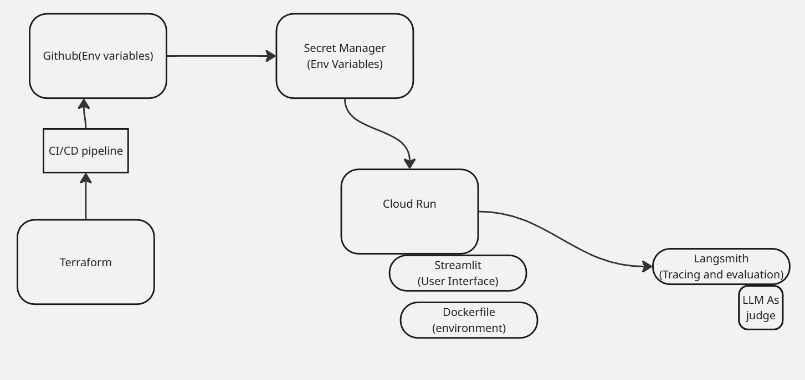

# Fitness Assistant by Phillips

## 🏋️ Problem Description

Many people struggle to find clear, personalized workout guidance.
Online resources are scattered, and beginners often feel overwhelmed by equipment choices, form instructions, and exercise variety.

**Fitness Assistant by Phillips** solves this by offering an AI-powered chat assistant that helps users discover and understand exercises quickly and interactively.

## 📂 Dataset

The project uses a synthetic dataset of **500 exercises**, generated with ChatGPT and stored in the `data` folder. Each entry includes:

- **Exercise Name**
- **Type of Activity** (e.g., Strength, Stretching)
- **Equipment Used**
- **Target Body Part**
- **Movement Type** (Push, Pull, Hold)
- **Muscle Groups Activated**
- **Instructions**
- **Video Link**

Example:

```
Yoga Flow | Stretching | Foam Roller | Core | Hold | Quadriceps, Glutes, Hamstrings | Step forward... | [Video](https://www.youtube.com/watch?v=op9kVnSso6Q)
```

## 🤖 What It Does

Users can chat with the assistant to:

1. Discover exercises based on body part, equipment, or goal
2. Get step-by-step instructions
3. Watch demo videos
4. Build a workout routine with natural language prompts
5. Get replacement for exercise in their routine. The assistant can suggest suitable alternatives that target the same muscle groups or require similar equipment.


Example queries:

> "Show me upper body push exercises with a kettlebell."
> "How do I do a cable row?"

This tool makes fitness guidance fast, accessible, and user-friendly.

---

Built to make staying fit easier and smarter.

---


## Running It

1. Prerequisites:

    A.  Poetry is used to manage packages and dependencies using a pyproject.toml file


    ```bash
    pip install poetry
    ```

    B. Installing the dependencies:

    ```bash
    poetry install
    ```


    C. Install qdrant for managing the Vector DB.
    There are 2 methods for using qdrant.

     i. Using docker locally

        a. Pull  qdrant container  in docker
        ```bash
        docker pull qdrant/qdrant
        ```


        b. Running qdrant  in docker
        6333 is for the REST API
        6334 is for the gRPC API
        quadranst_storage  mounts local storage to keep data persistent even if the container is deleted/restarted
        ```bash
        docker run -p 6333:6333 -p 6334:6334 -v"$(pwd)/qdrant_storage:/qdrant/storage:z" qdrant/qdrant
        ```

        C. Install qdrant client and fastembed which does the data vectorization. This is already stated in pyproject.toml
        ```bash
        pipenv install -q "qdrant-client[fastembed]>=1.14.2"
        ```

         Access the vector db in quandrant by going to http://localhost:6333/dashboard

     ii. Using the Qdrant cloud free tier cluster as shown [here](https://qdrant.tech/documentation/cloud/create-cluster/)
     It provides you a UI(which allows you see the data points of each vectors), and an API key to connect


    D. Create API key from google ai studio [here](https://aistudio.google.com/)

    E. Environment Variables
    Ensure to create a .env file to store your environment variables

    QDRANT_API_KEY=<QDRANT_API_KEY>
    GOOGLE_API_KEY=<GOOGLE_API_KEY
Note, you would need to update the <cluster_url> in fitness_assistant/rag/settings.py

2. Running Jupyter Notebook for experiments
Disregard the notebooks, as it's largely for experiments
```bash
cd notebooks
pipenv run jupyter notebook
```

Running pre-commit on files before pushing to git branch
```bash
pipenv run pre-commit run --all-files
```


Running the elastic search server
 in docker
```bash
docker run -it --name elasticsearch -p9200:9200 -p9300:9300 -e "discovery.type=single-node" -e "xpack.security.enabled=false" docker.elastic.co/elasticsearch/elasticsearch:8.4.3
```


install pre-commit as part of workflows
```bash
pre-commit install
```

3. Running the app

i. cd into fitness_assistant/rag directory.
There are 2 modes for executing the llm_interface.py script.

ii. To create a collection of vector embeddings, and also ask the user for his/her question
```bash
python llm_interface.py --create-vectors
```

iii. To run the RAG pipeline on an existing collection of vector embeddings
```bash
python llm_interface.py

```

## Next steps
1. Deployment
A cloud run deployment



## Evaluation(Incomplete) - using DeepEval
There is an evaluation script created in rag/evaluation.py
it.
i. Define test data(a set of questions, and expected  ideal answer).
 This is  the evaluation set.

ii. For each query, get the context from the vector db, pass to the LLM for a full response(As observed in LLM_interface.py).

iii. LLMTestCases are created. Each test case contains:-
a. The original query
b. The actual ouput generated by RAG
c. Expected output: which is the ground truth
d. retrival context: documents gatherd from vector db

iv. Define evaluation metrics, such as
AnswerRelevancyMetric(how relevant is the answer to the question?), FaithfulnessMetric(Does the answer stick to the facts in the context?), ContextualRecallMetric(Did vector db retrieve all the info needed to answer?).

v. Deepeval goes through each test case, uses Gemini to score actual output against each metric
## Retrieval


## Monitoring

## Improvements
1. Use pydantic output parser to prevent prompt Injection.
2. Langsmith for tracing, prompt /versioning
3. Monitoring pipeline to catch hallucinations.
4. Improve data quality(Instructions column)
5. Retrieval quality [using HSNW](https://qdrant.tech/documentation/beginner-tutorials/retrieval-quality/)
6. Increase data used for building vector db
7. improve data quality
8. add streamlit frontend
9. llm-as-a-judge


## Decision logic
1. elected jina-embeddings-v2-small-en because of the following:

 - modest model size and vector dimension, making it efficient to index and query in free-tier infrastructure

 - good semantic embedding capability for English, especially for relatively short structured text (exercise descriptions, instructions)

- compatibility with long input lengths (it supports up to 8192 tokens in its embedding family)

- balanced cost, performance, and resource usage

However, there are some potential models in the [mteb leaderboard](https://huggingface.co/spaces/mteb/leaderboard)  that may offer better performance.

2. Using Gemini
- A big part for this decision is because of easy integration to GCP
- while current RAG is text-based, dataset contains video links which is great as Gemini is multimodal
- Generous Free Tier

3. Generation Parameters
temperature(0.4), top_p(1), top_k(1), max_output_tokens(4000)

Attempt | temperature(0.4) |top_k(1) | top_p(1) | max_output_tokens(4000)
--- | --- | --- | --- |---
what it contols? | Governs model randomness | restrict model choice to the k most likely next tokens | An alternative to top_k. | LLM Output  |
Justification | Reliability. model sticks closely to context from db, and is less likely to make stuff up | restrictive. ensures model select only the single most likely next token at each point | a p-value of 1 tells Gemini to assign temperature/top_k as primary output controller | Cost  |
