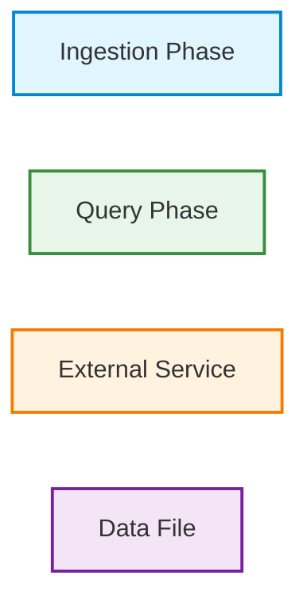
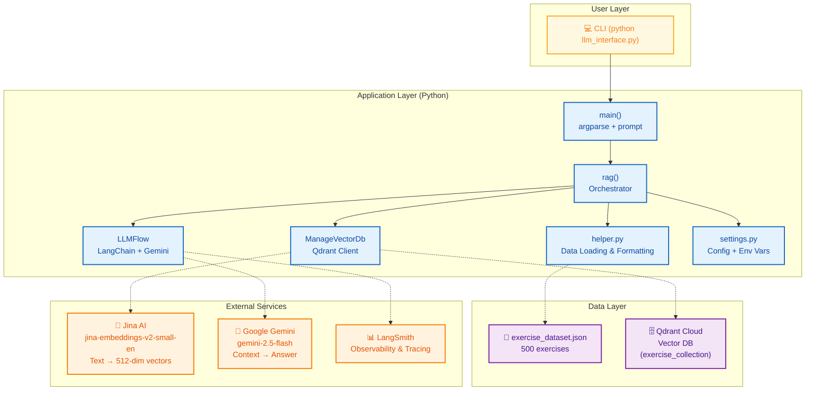

# End-to-End Flowchart: Fitness Assistant RAG System

This document provides a complete visual walkthrough of how the Fitness Assistant works, from loading exercise data to answering user questions. Two formats are provided: a high-level flowchart and a detailed technical flowchart.

---

## Flowchart Legend



---

## 1. High-Level Overview

```
┌──────────────────────────────────────────────────────────────────┐
│                    PHASE 1: INGESTION (One-Time Setup)           │
│                                                                  │
│  JSON File ──► Load & Clean ──► Build Summary Card ──► Embed ──►│
│  (500 exercises)             (deduplicate,    (concatenate,  (Jina AI   │
│                                normalise)      label fields)   512-dim)  │
│                                                                  │
└──────────────────────────────────────────────────────────────────┘
                               │
                               ▼
                    ┌─────────────────────┐
                    │   Qdrant Vector DB   │
                    │   (512-dim vectors   │
                    │    + payloads)       │
                    └─────────────────────┘
                               ▲
┌──────────────────────────────────────────────────────────────────┐
│                    PHASE 2: QUERY (Every Question)               │
│                                                                  │
│  User Query ──► Embed ──► Cosine Similarity ──► Top 3 ──►       │
│  "calf ex."   (Jina AI    (compare query      Results   Format   │
│                512-dim)     vs all 500)                 Context  │
│                                                                  │
└──────────────────────────────────────────────────────────────────┘
                               │
                               ▼
                    ┌─────────────────────┐
                    │   Gemini 2.5 Flash   │
                    │   (LLM Generation)   │
                    │   + LangChain Chain  │
                    └─────────────────────┘
                               │
                               ▼
                    ┌─────────────────────┐
                    │   Final Answer to    │
                    │       User           │
                    └─────────────────────┘
```

---

## 2. Detailed Mermaid Flowchart

```mermaid
flowchart TD
    %% ========================================================================
    %% PHASE 1: DATA INGESTION (One-time setup)
    %% ========================================================================
    subgraph Ingestion["Phase 1: Data Ingestion (--create-vectors)"]
        direction TB

        A1["📄 detailed_exercise_dataset_v2.json<br/>(500 exercises)"]:::data
        A2["helper.py: load_json_data()<br/>- Parse JSON<br/>- Flatten primary + secondary muscles<br/>- Derive body_part<br/>- Join list fields"]:::code
        A3["helper.py: clean_data()<br/>- Drop duplicates on exercise_name<br/>- Lowercase columns<br/>- Replace spaces with underscores"]:::code
        A4["helper.py: create_document()<br/>- DataFrame → list[dict]"]:::code

        A5{"llm_interface.py: collection_exists()"}
        A6["create_collection(name, dimension=512)<br/>- Set COSINE distance metric"]:::code
        A7["client.delete_collection()"]:::code

        subgraph Embedding["For Each of 500 Exercises"]
            direction LR
            B1["get_text_embedding_string(record)"]
            B2["Build: Exercise Name — Type —<br/>Equipment — Muscles —<br/>Body Part — Description — Instructions"]
            B3["models.Document(text=string,<br/>model='jinaai/jina-embeddings-v2-small-en')"]
            B4["Jina AI generates<br/>512-dim vector"]
        end

        B5["get_payload(record, context_mapping)<br/>- Store ALL fields as metadata"]:::code
        B6["PointStruct(id, vector, payload)"]:::code
        B7["client.upsert(collection, points)<br/>(Batch insert to Qdrant)"]:::code

        A1 --> A2 --> A3 --> A4
        A4 --> A5

        A5 -- "❌ Collection doesn't exist" --> A6
        A5 -- "✅ Collection exists" --> A8{"recreate_collection?"}
        A8 -- "Yes" --> A7 --> A6
        A8 -- "No" --> A9["Skip creation"]

        A6 --> A10["Create Payload Indexes<br/>(keyword indexes on type_of_activity,<br/>body_part, equipment, muscles, name)"]
        A9 --> A10

        A10 --> A11["Collection Ready<br/>(exercise_collection)"]

        A11 --> Embedding
        B1 --> B2 --> B3 --> B4
        B4 --> B5 --> B6 --> B7
    end

    %% ========================================================================
    %% PHASE 2: QUERY AND GENERATION (Every user question)
    %% ========================================================================
    subgraph Query["Phase 2: Query & Generation"]
        direction TB

        C1["👤 User types: 'give me exercises that build my calf'"]:::user
        C2["llm_interface.py: rag(user_query)"]:::code
        C3["ManageVectorDb: search(query)"]:::code
        C4["models.Document(text=query,<br/>model='jinaai/jina-embeddings-v2-small-en')"]:::code
        C5["Jina AI generates<br/>512-dim query vector"]:::code

        C6["Qdrant: Cosine Similarity<br/>Compare query vector against ALL 500"]:::code
        C7["HNSW Graph Traversal<br/>(logarithmic search)"]:::code

        C8["Top 3 Results Returned<br/>With full payloads"]:::result
        C9["helper.py: format_vector_db_context()<br/>- Convert payloads to readable text"]:::code

        C10["LLMFlow: __init__()<br/>- ChatGoogleGenerativeAI(model='gemini-2.5-flash')<br/>- Build LangChain prompt | llm chain"]:::code
        C11["LLMFlow: run(query, context)<br/>- chain.invoke({question, context})"]:::code
        C12["🤖 Gemini generates answer<br/>using ONLY the retrieved context"]:::gemini
        C13["📋 Final answer displayed<br/>via rich console panel"]:::result
    end

    %% Connect Phase 1 to Phase 2
    B7 -. "Vectors stored in Qdrant Cloud" .-> C6

    %% Phase 2 flow
    C1 --> C2 --> C3 --> C4 --> C5 --> C6 --> C7 --> C8 --> C9 --> C10 --> C11 --> C12 --> C13

    %% ========================================================================
    %% STYLING
    %% ========================================================================
    classDef ingestion fill:#e1f5fe,stroke:#0288d1,stroke-width:2px,color:#01579b;
    classDef retrieval fill:#e8f5e9,stroke:#388e3c,stroke-width:2px,color:#1b5e20;
    classDef external fill:#fff3e0,stroke:#f57c00,stroke-width:2px,color:#e65100;
    classDef data fill:#f3e5f5,stroke:#7b1fa2,stroke-width:2px,color:#4a148c;
    classDef code fill:#f5f5f5,stroke:#616161,stroke-width:1px,color:#212121;
    classDef result fill:#e8f5e9,stroke:#2e7d32,stroke-width:2px,color:#1b5e20;
    classDef user fill:#fff8e1,stroke:#f9a825,stroke-width:2px,color:#f57f17;
    classDef gemini fill:#e3f2fd,stroke:#1565c0,stroke-width:2px,color:#0d47a1;

    class A1 data;
    class A2,A3,A4,A6,A7,B5,B6,B7,C2,C3,C4,C9,C10 code;
    class C1 user;
    class C8,C13 result;
    class C12 gemini;

    %% Apply to subgraph labels by assigning to elements inside
    class A5,A8 decision;
    class B1,B2,B3,B4 embed;
    class C5,C6,C7 search;
```



---

## 3. Step-by-Step Walkthrough of Each Numbered Node

### Phase 1: Data Ingestion

| Step | File:Function | What Happens | Why |
|------|--------------|--------------|-----|
| **A1** | `detailed_exercise_dataset_v2.json` | 500 exercises stored in structured JSON with categories, equipment lists, exercises with name/category/description/equipment/instructions/muscles/video | Source data — every exercise in the system |
| **A2** | `helper.py:load_json_data()` | Reads JSON, flattens `primary_muscles` + `secondary_muscles` into `muscle_groups_activated`, derives `body_part` from primary muscles, joins list fields into strings | Normalises the rich JSON structure into a flat tabular format that the pipeline can process |
| **A3** | `helper.py:clean_data()` | Drops duplicate exercise names, converts column names to lowercase with underscores | Ensures data quality — no duplicate vectors, consistent column naming |
| **A4** | `helper.py:create_document()` | Converts pandas DataFrame into a list of Python dictionaries | The format needed for iterative processing (one dict per exercise) |
| **A5** | `llm_interface.py:collection_exists()` | Checks Qdrant for existing collection named `exercise_collection` | Prevents errors — either creates fresh or appends to existing |
| **A6** | `llm_interface.py:create_collection()` | Creates a new Qdrant collection configured for 512-dim vectors with COSINE distance metric | Required before any vectors can be inserted |
| **B1-B4** | `llm_interface.py:get_text_embedding_string()` | For each exercise: builds a concatenated string from name, type, equipment, muscles, body part, description, instructions. Sends to Jina AI model via FastEmbed | This string determines the "semantic fingerprint" — query matches happen against this text |
| **B5** | `llm_interface.py:get_payload()` | Stores all exercise fields (including video_link, variations_on which were NOT embedded) as metadata | Payload is what gets returned with search results — provides full exercise info without affecting search |
| **B6-B7** | `llm_interface.py:create_points_and_insert()` | Creates PointStruct(id, vector, payload) for each exercise, batch upserts to Qdrant | Inserts all 500 vectors into the collection in one API call |

### Phase 2: Query & Generation

| Step | File:Function | What Happens | Why |
|------|--------------|--------------|-----|
| **C1** | User input | User types a natural language query like "give me exercises that build my calf" | The starting point — could be any fitness-related question |
| **C2** | `llm_interface.py:rag()` | Entry point — creates ManageVectorDb and LLMFlow instances, orchestrates the pipeline | Separates concerns: DB operations from LLM generation |
| **C3-C5** | `llm_interface.py:search()` | Embeds the user query using the **same** Jina model used during ingestion | The query and documents must be in the **same vector space** for comparison to be meaningful |
| **C6** | Qdrant | Qdrant computes cosine similarity between the query vector and all 500 stored vectors: `cos(θ) = (A·B)/(\||A\|\|\||B\|\|)` | Cosine similarity is the standard metric for measuring semantic similarity between vectors |
| **C7** | Qdrant (internal) | HNSW graph algorithm navigates through the vector index in O(log n) time | Without HNSW, searching 500 vectors would require O(n) — still fast at 500, but critical for scaling |
| **C8** | Qdrant | Returns top 3 `ScoredPoint` objects, each containing score + payload with all exercise fields | `response_limit=3` — a trade-off between context relevance and LLM token consumption |
| **C9** | `helper.py:format_vector_db_context()` | Converts each payload into a labelled text block using `context_mapping` field names | Transforms raw payload dicts into readable text the LLM can consume |
| **C10** | `llm_interface.py:LLMFlow.__init__()` | Initialises Gemini 2.5 Flash with temperature=0.4, top_k=1, builds LangChain prompt template | LLM configuration tuned for reliable, factual output |
| **C11** | `llm_interface.py:LLMFlow.run()` | Invokes the LangChain chain: system prompt (fitness instructor) + human prompt (question + context) | The core RAG step — LLM receives both the question and the retrieved documents |
| **C12** | Google Gemini API | Gemini generates a response using **only** the facts in the provided context | RAG's key benefit: grounded generation with no hallucination |
| **C13** | Rich console | Final answer displayed in a formatted panel with title "Assistant's Answer" | User interface — currently CLI-based, can be extended to web/streamlit |

---

## 4. Data Transformation Flow

This shows how data changes shape at each step of the pipeline:

```
PHASE 1 — INGESTION
====================

[JSON Structure]                  →  [Flat DataFrame]           →  [List of Dicts]
{                                   exercise_name  | type...       [{exercise_name: ...,
  "exercises": [                     Standing Calf  | Strength       type_of_activity: ...,
    { name: "Standing Calf Raise",   Seated Calf    | Stretching     ...}]
      category: "strength",          ...                            ...]
      primary_muscles: ["calves"],  (500 rows × 10 cols)         (500 dicts)
      ... }
  ]                                                                      ↓
}                                                                 [Embedding String]
                                                                   "Exercise Name: Standing Calf Raise —
                                                                    Type of Activity: Strength —
                                                                    Equipment: Dumbbell —
                                                                    Muscle Groups: Calves —
                                                                    Body Part: Calves —
                                                                    Instructions: Stand with feet..."
                                                                           ↓
[512-dim Vector]              ←  [Jina AI Model]  ←  [models.Document(text, model)]
[0.23, -0.45, 0.12, ...,
 0.89] (512 numbers)
           ↓
[Qdrant PointStruct]
{ id: 0,
  vector: [0.23, -0.45, ..., 0.89],
  payload: { exercise_name: "Standing Calf Raise",
             muscle_groups_activated: "Calves",
             video_link: "https://...",
             ... }
}
           ↓
[Qdrant Collection]
"exercise_collection" with 500 points


PHASE 2 — QUERY
===============

[User Query]                    →  [Query Vector]              →  [Cosine Similarity]
"give me exercises               [0.19, -0.38, ..., 0.92]        Query vs Exercise #0:  0.85
 that build my calf"                                              Query vs Exercise #1:  0.82
                                                                  Query vs Exercise #2:  0.45
                                                                  ... vs all 500
                                                                           ↓
[Top 3 Payloads]               ←  [Qdrant Results]             ←  [Top 3 by Score]
{ exercise_name,                  ScoredPoint(score=0.85),       Exercise #0:  Standing Calf Raise
  type_of_activity,               ScoredPoint(score=0.82),       Exercise #1:  Seated Calf Raise
  instructions,                   ScoredPoint(score=0.45)}       Exercise #42: Squat
  video_link, ... }                                                       ↓

[Formatted Context]             →  [LangChain Prompt]          →  [Gemini Response]
"Exercise: Standing Calf Raise   System: You're a fitness       "Here are two great exercises
 Type: Strength                   instructor... Answer the        for building your calves:
 Equipment: Dumbbell              QUESTION based on the
 ..."                             CONTEXT..."                    1. Standing Calf Raise...
                             ───▶ Human: QUESTION + CONTEXT      2. Seated Calf Raise..."
                                                                           ↓
                                                                [User Sees Final Answer]
```

---

## 5. Key Design Decisions Visualised

```mermaid
flowchart LR
    subgraph Decisions["Key Design Decisions"]
        direction TB
        D1["❓ Why Jina embeddings?"] --> D1A["Small model (35M params)<br/>Runs on CPU"]
        D1 --> D1B["512 dimensions<br/>Free-tier friendly"]
        D1 --> D1C["8192 token limit<br/>Handles full exercise text"]
        D1 --> D1D["English-optimised<br/>Dataset is all English"]

        D2["❓ Why Gemini 2.5 Flash?"] --> D2A["GCP integration<br/>Future Cloud Run deploy"]
        D2 --> D2B["Multimodal<br/>Video links in dataset"]
        D2 --> D2C["Free tier<br/>No cost for prototyping"]

        D3["❓ Why temperature=0.4?"] --> D3A["Low creativity<br/>Sticks to retrieved facts"]
        D3 --> D3B["Reduces hallucination<br/>Less likely to make things up"]

        D4["❓ Why top-3 retrieval?"] --> D4A["Enough context<br/>3 exercises ≈ 1-2 paragraphs"]
        D4 --> D4B["Token efficient<br/>Fits within LLM context window"]
        D4 --> D4C["Focus: best matches only<br/>Avoids information overload"]
    end

    classDef decision fill:#fff8e1,stroke:#f9a825,stroke-width:2px,color:#f57f17;
    classDef answer fill:#e8f5e9,stroke:#388e3c,stroke-width:1px,color:#1b5e20;

    class D1,D2,D3,D4 decision;
    class D1A,D1B,D1C,D1D,D2A,D2B,D2C,D3A,D3B,D4A,D4B,D4C answer;
```



---

## 6. System Architecture Diagram



---

## 7. Query Resolution Timeline

```
Time ──────────────────────────────────────────────────────────────────────►

User: "give me exercises that build my calf"
         │
         ▼    ~200ms                          ~800ms                        ~1200ms
    ┌──────────────┐                  ┌──────────────────┐           ┌────────────────┐
    │  Jina Embed   │                  │  Qdrant Search    │           │  Gemini        │
    │  (512-dim)    │ ──────────────►  │  (cosine sim ×    │ ────────►│  Generate      │
    │  ~200ms       │                  │   500 vectors)    │           │  (1-2 sec)     │
    └──────────────┘                  │  ~30ms             │           └────────────────┘
                                       └──────────────────┘                    │
                                                                               ▼
                                                                      "Here are exercises
                                                                       for your calves:
                                                                       1. Standing Calf Raise..."
                                                                       (Final answer)
```

**Estimated total response time**: 2-4 seconds (varies based on Gemini API latency and network conditions)

The bottleneck is almost always the LLM generation step (Gemini). Vector search at 500 exercises completes in ~30ms. Even at 500,000 exercises, HNSW would keep search under 100ms.

---

*Flowcharts created with [Mermaid](https://mermaid.js.org/). Render in any Mermaid-compatible Markdown viewer (GitHub, VS Code with Mermaid extension, etc.).*
